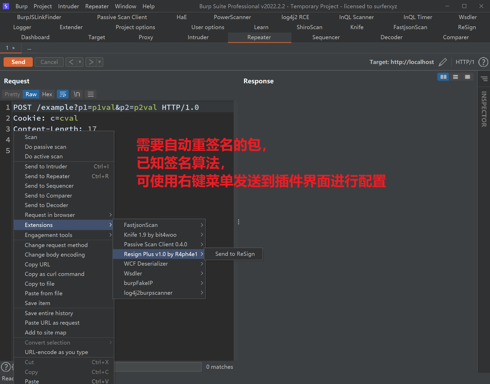
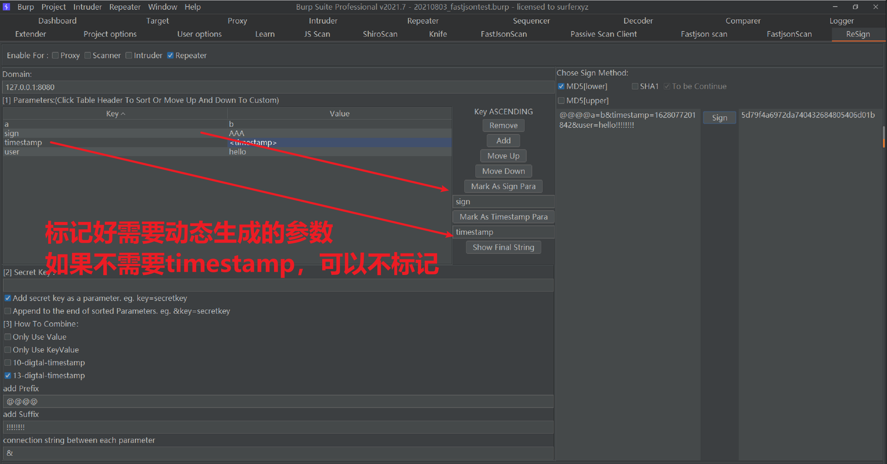
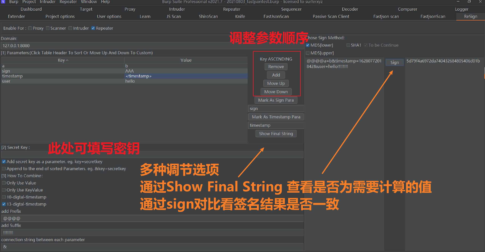
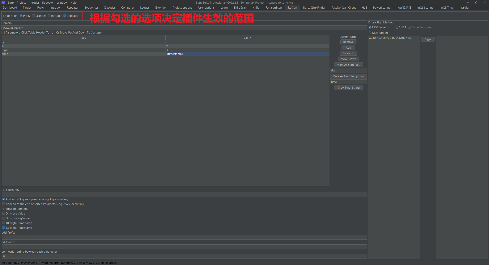
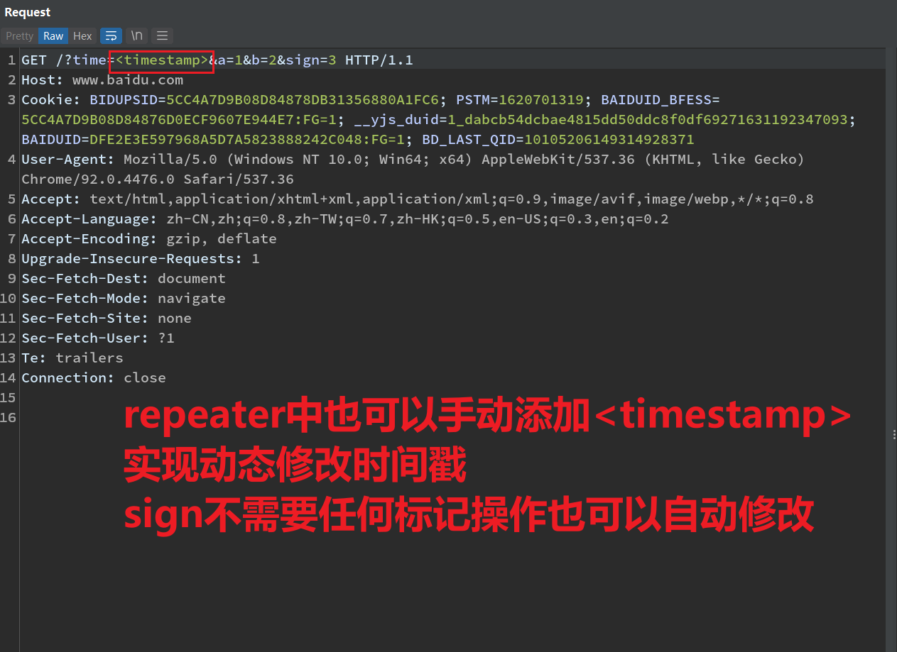
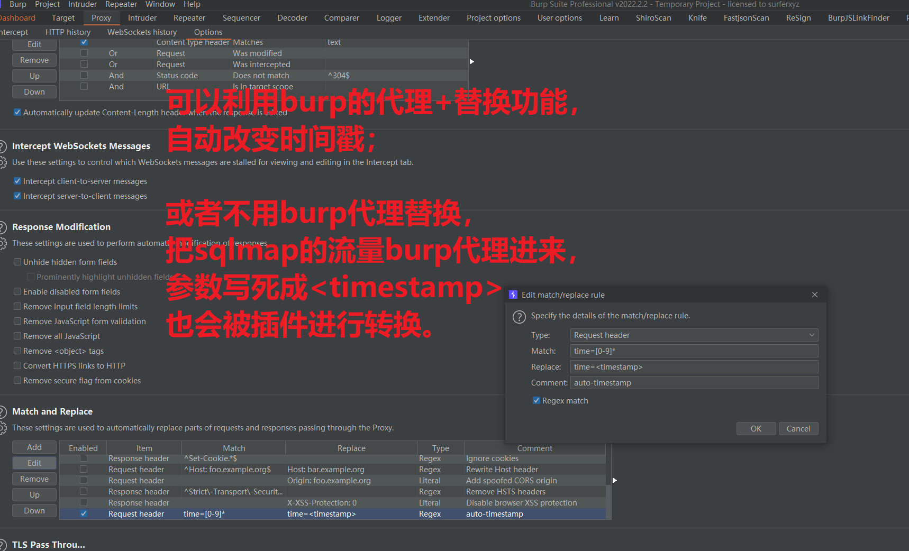

# Resign Plus

---

## 介绍

基于对[bit4woo](https://github.com/bit4woo)/**[ReSign](https://github.com/bit4woo/ReSign)**项目的改造，感谢bit4woo师傅的项目。

新增加更多好用的功能。如自动计算时间戳，增加更多灵活调整明文的手段。

## 使用方法

右键->发送到插件：该功能主要是对于已知签名算法，需要配置自动重签名的情况，发送到插件界面进行签名算法配置。

在插件界面中，标记需要自动计算的参数，如果不需要用到timestamp可以不标记，但sign必须标记。

您可以在插件界面中部的按钮，删除不必要的参数、调整参数顺序逆序等方式获得相应的明文；如果你需要，还可以在下方添加secret，调整参数拼接的方式；最后通过 show final string 按钮获得最终需要的明文，再点击 sign 按钮得到签名。（我相信您多尝试一下就会明白如何调整这些选项）

值得一提的是，当您需要自动重签名的时候，勾选插件生效范围是必要的。

## 时间戳功能

在proxy、repeater中，需要标记`<timestamp>`才能自动修改时间戳。（sign在插件界面调整好后，在proxy、repeater中会自动计算，不需要任何标记操作）

您可以使用替换功能，对时间戳的参数进行自动替换。或者当您使用sqlmap等工具时，将参数手动编辑为<timestamp>，再将流量代理到burpsuite中。

